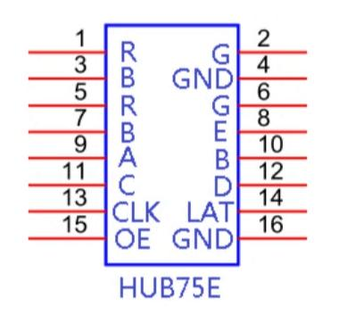
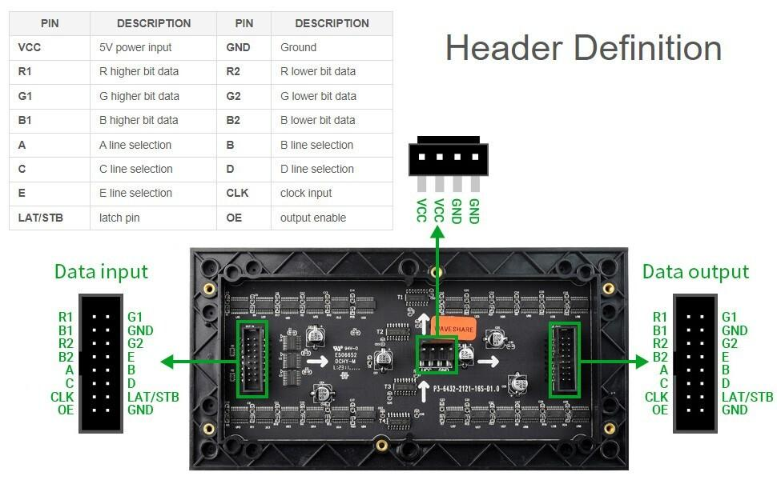
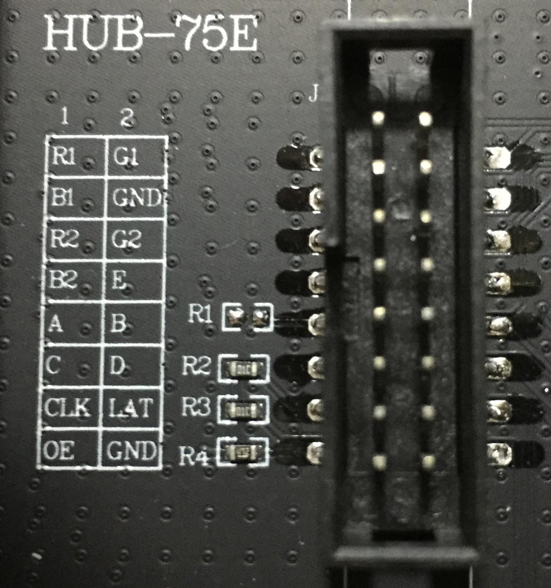

HUB75E 是 RGB LED 点阵屏（如 P2.5、P3、P4、P5、P6、P10 等）的常用接口，采用 **16Pin IDC 排线接口（2×8）**。相比 HUB75，HUB75E 增加了 **E 地址线**，用于支持 1/32 扫描的高分辨率屏（例如 64×64）。([ledfixlab.com][1])

下面是常见 **HUB75E 引脚定义**：

| Pin | 信号        | 功能              |
| --- | --------- | --------------- |
| 1   | R1        | 上半屏红色数据         |
| 2   | G1        | 上半屏绿色数据         |
| 3   | B1        | 上半屏蓝色数据         |
| 4   | GND       | 地               |
| 5   | R2        | 下半屏红色数据         |
| 6   | G2        | 下半屏绿色数据         |
| 7   | B2        | 下半屏蓝色数据         |
| 8   | E         | 行地址 E（HUB75E专用） |
| 9   | A         | 行地址 A           |
| 10  | B         | 行地址 B           |
| 11  | C         | 行地址 C           |
| 12  | D         | 行地址 D           |
| 13  | CLK       | 移位时钟            |
| 14  | LAT / STB | 锁存信号            |
| 15  | OE        | 输出使能（低有效）       |
| 16  | GND       | 地               |

([olympianled.com][2])

### 接口排列（从屏幕接口正面看）

```
HUB75E 16PIN

   1   2
   3   4
   5   6
   7   8
   9  10
  11  12
  13  14
  15  16


1  R1       2  G1
3  B1       4  GND

5  R2       6  G2
7  B2       8  E

9  A       10  B
11 C       12  D

13 CLK     14 LAT
15 OE      16 GND
```

---

## 各信号作用简单说明

### 1. RGB 数据线

HUB75E 一次传输上下两行：

```
R1 G1 B1  → 上半部分LED
R2 G2 B2  → 下半部分LED
```

例如：

* 选择第0行
* 发送一串 RGB 数据
* CLK 每跳一次移入一个像素
* LAT 锁存
* OE 打开显示

---

### 2. 地址线 A-E

用于选择扫描行：

| 地址线 | 扫描范围 |
| --- | ---- |
| A   | bit0 |
| B   | bit1 |
| C   | bit2 |
| D   | bit3 |
| E   | bit4 |

例如：

### 1/16扫描

只需要：

```
A B C D
```

选择：

```
0~15 行
```

### 1/32扫描

需要：

```
A B C D E
```

选择：

```
0~31 行
```

所以：

* 32×16、64×32 通常没有 E
* 64×64 HUB75E 通常必须 E

([WaveShare][3])

---

### 3. 控制信号

#### CLK

移位时钟：

```
CLK ↑
数据进入移位寄存器
```

---

#### LAT

锁存：

```
LAT = 1
    ↓
把移位数据送到LED驱动芯片
```

---

#### OE

输出使能：

**低有效**

```
OE=0  显示
OE=1  熄灭
```

刷新时一般流程：

```
OE=1 关闭显示
 ↓
设置 A-E 行地址
 ↓
发送 RGB 数据 + CLK
 ↓
LAT锁存
 ↓
OE=0显示
```

([WaveShare][3])

---

## ESP32 驱动 HUB75E 示例对应关系

例如 ESP32：

```
GPIO → HUB75E

R1  GPIO25
G1  GPIO26
B1  GPIO27

R2  GPIO14
G2  GPIO12
B2  GPIO13

A   GPIO23
B   GPIO19
C   GPIO5
D   GPIO17
E   GPIO18

CLK GPIO16
LAT GPIO4
OE  GPIO15
GND GND
```

（这里只是示例，不是固定定义）

---

## 注意事项（很重要）

1. **LED屏供电不是5V小电流**

   HUB75E屏通常：

```
VCC = 5V
```

例如：

64×64 RGB：

可能需要：

```
5V 5A~10A
```

不要从 ESP32 供电。

---

2. **ESP32 GPIO 是3.3V**

多数 HUB75E 屏：

* 3.3V逻辑可以工作
* 长排线、高刷新率建议加：

  * 74AHCT245
  * 74HCT245

做电平转换。

---

3. **不同厂家可能有微小差异**

尤其：

* Pin8 有时接 E
* 有些屏 Pin8 接 GND

所以最好看 PCB 丝印：

```
R1
G1
B1
E
A
B
C
D
CLK
LAT
OE
```

确认。
